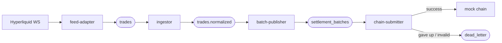
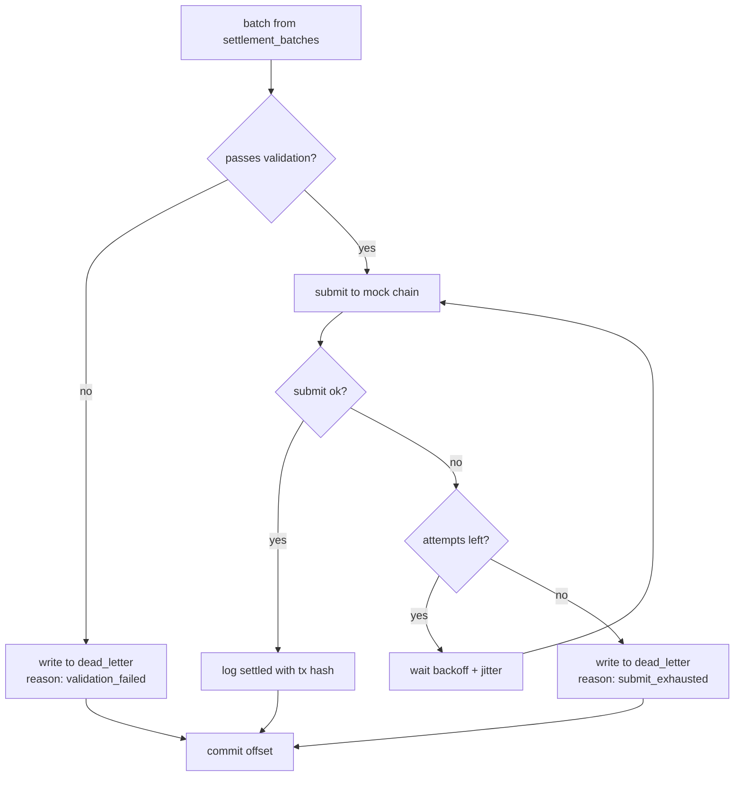
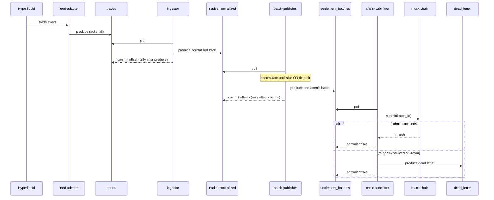
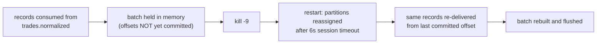

# TIPRUN Settlement Pipeline

This is my take-home submission for the settlement infrastructure exercise.

The system reads live trades from the Hyperliquid public WebSocket, groups the
resulting payouts into batches, and submits each batch as a single (mocked)
on-chain transaction. It's written in Go, uses Redpanda as the broker, and
franz-go as the Kafka client.

**Intro walkthrough**

[](https://www.loom.com/share/0aa2652adedb4315ab12c244be16f515)

It runs as four separate processes so that any one of them can be restarted
mid-run without losing data:



If you only read one thing, read [Delivery guarantee](#delivery-guarantee-and-where-i-commit-offsets)
and [Failure modes](#failure-modes) — that's where the interesting decisions are.

## Requirements I set for myself

The brief was open-ended, so I scoped it down first. What I committed to getting
right:

1. Pull live Hyperliquid trades for a set of coins and put them on a `trades`
   topic using my own schema.
2. Reconnect automatically when the WebSocket drops.
3. Batch trades and flush when either a size limit or a time window is hit, both
   configurable without touching code.
4. Publish each batch as one atomic Kafka message.
5. Validate a batch before submitting it, with rules I define.
6. Submit to a mock chain that has a realistic random delay and can fail, and
   retry failures.
7. Send anything that can't be settled to a `dead_letter` topic. Never drop it.
8. Make every process independently restartable with no data loss.
9. Log every important step as structured JSON.

What I chose not to build is listed in [Trade-offs](#trade-offs-and-what-i-left-out).

## The four components

| Process         | Reads from           | Writes to            | Job                                                         |
| --------------- | -------------------- | -------------------- | ----------------------------------------------------------- |
| feed-adapter    | Hyperliquid WS       | `trades`             | connect, subscribe, ping, reconnect, map to internal schema |
| ingestor        | `trades`             | `trades.normalized`  | validate, normalize, drop duplicates                        |
| batch-publisher | `trades.normalized`  | `settlement_batches` | accumulate and flush one batch per size/time trigger        |
| chain-submitter | `settlement_batches` | `dead_letter`        | validate, submit with retries, dead-letter on failure       |

### Why the ingestor and batch-publisher are two processes

The brief said this was my call. I split them because they behave differently: the
ingestor is stateless per record (check it, forward it), while the batch-publisher
holds the in-progress batch in memory. Keeping them apart means I can restart or
retune the batching logic without disturbing ingestion, and each process does one
thing.

They hand off through a Kafka topic (`trades.normalized`) rather than a shared
store like Redis. That keeps everything on Kafka with no extra infrastructure,
gives me a durable buffer between the two for free, and lets each side own its own
offsets. The price is one extra topic and one more serialize/deserialize hop, which
is fine at this volume.

### Concurrency

Each service is basically one goroutine running a poll -> process -> commit loop.
The only extra goroutines are in the feed-adapter (a ping ticker and the reconnect
supervisor). I kept it single-threaded on purpose to avoid shared state and locks;
if this needed to scale you'd add partitions and more consumer instances rather
than threads inside one process. The only shared, lock-guarded object is the mock
chain's idempotency map.

## Message schemas

Prices, sizes and notionals are carried as decimal strings rather than floats, and
the math uses shopspring/decimal, so notional and batch totals are exact. That
matters for anything settlement-related.

`trades` and `trades.normalized` (message key is the coin):

```json
{
  "trade_id": "1783196022020-BTC-978308704788862",
  "coin": "BTC",
  "side": "buy",
  "price": "63351.0",
  "size": "0.00137",
  "notional": "86.79087",
  "event_time_ms": 1783196022020,
  "hash": "0x0000...0000",
  "ingest_time_ms": 1783196045407,
  "source": "hyperliquid"
}
```

`trade_id` is `{event_time_ms}-{coin}-{tid}`. The Hyperliquid docs say to combine
block time, coin and `tid` for a globally unique id, so that's what I do. `hash`
can be the zero-hash for TWAP fills. `trades.normalized` has the same shape after
validation and dedup.

`settlement_batches`, one atomic message per batch (key is `batch_id`):

```json
{
  "batch_id": "batch-p0_0_24",
  "created_at_ms": 1783196044667,
  "flush_reason": "size",
  "trade_count": 25,
  "total_notional": "950761.1088629",
  "trades": ["...array of trade objects..."],
  "producer": "batch-publisher"
}
```

The `batch_id` is built from the source offset span
(`batch-p{partition}_{minOffset}_{maxOffset}`). I did this on purpose: if the
batch-publisher crashes and rebuilds a batch from the same offsets, it gets the
same id, so the chain submitter can recognise and skip a duplicate. It's
best-effort though, because a time-based flush after a restart can land on
different boundaries.

`dead_letter` (key is `batch_id`):

```json
{
  "batch_id": "batch-p0_0_24",
  "original_batch": { "...the full batch..." },
  "failure_reason": "submit_exhausted",
  "attempts": 3,
  "last_error": "chain: transient submission error",
  "failed_at_ms": 1783197127120
}
```

The whole original batch is kept so it can be replayed or inspected later.

## Validation rules

Before the chain submitter submits a batch, it checks (`internal/validate`):

- `batch_id` is present.
- `trade_count > 0` and equals the number of trades in the array.
- Every trade is valid on its own: non-empty `trade_id` and `coin`, a real side,
  and strictly positive price and size.
- No duplicate `trade_id` inside the batch.
- The `total_notional` recomputed from the trades matches the declared total.

If a batch fails validation it goes straight to `dead_letter` with reason
`validation_failed`. There's no point retrying a structurally broken batch. The
same trade-level checks also run in the ingestor, so bad trades get dropped before
they ever reach a batch.

Here's how the chain submitter decides what to do with each batch:



## Delivery guarantee and where I commit offsets

The pipeline is at-least-once end to end.

Every consumer has autocommit turned off and commits its offset only after the
next step has actually succeeded:

- ingestor commits `trades` only after the record lands on `trades.normalized`.
- batch-publisher commits `trades.normalized` only after the batch is acked on
  `settlement_batches`.
- chain-submitter commits `settlement_batches` only after a final outcome: either
  a successful submit, or a successful write to `dead_letter`.

This is the whole flow, with the commit points called out:



The trade-off: committing after the effect means the failure window is a duplicate,
never a loss. The obvious risk is the chain submitter dying right after the chain
accepts a submission but before the offset commit. On restart the batch comes back
and would be submitted twice. I handle that by making the mock chain idempotent on
`batch_id` — a repeat submit returns the original tx hash instead of submitting
again. On a real chain you'd lean on a nonce or an idempotency key the same way.

I did not do exactly-once with Kafka transactions. It's a fair bit more moving
parts (transactional producer, read-committed consumers, transactional offset
commits) and at-least-once with an idempotent sink is the normal, pragmatic answer
for this kind of pipeline. It's the first thing I'd add with more time.

## Failure modes

What I handle:

| Situation                                   | What happens                                                                                                                    |
| ------------------------------------------- | ------------------------------------------------------------------------------------------------------------------------------- |
| WebSocket drops                             | reconnect with exponential backoff, re-subscribe                                                                                |
| WebSocket goes idle                         | ping every 20s (server closes idle connections at 60s)                                                                          |
| Broker briefly unavailable on produce       | producer retries with backoff; the offset never moves past an unwritten record                                                  |
| A consumer is restarted mid-run             | uncommitted records are re-read; a 6s group session timeout means the restarted process gets its partitions back within seconds |
| batch-publisher dies with a half-full batch | those offsets were never committed, so the trades come back and get re-batched                                                  |
| Chain submit fails                          | exponential backoff with jitter, then dead-letter                                                                               |
| Invalid or unparseable batch                | dead-lettered immediately                                                                                                       |
| Duplicate delivery                          | dedup in the ingestor plus `batch_id` idempotency at the chain                                                                  |

What I don't handle (and know about):

- Exactly-once. Duplicates are possible; the idempotent sink absorbs them.
- Backfilling trades missed during a WebSocket outage from Hyperliquid's snapshot
  endpoint. A live-feed gap is possible.
- A poison message that crashes the ingestor repeatedly. Parse/validation failures
  are dropped, but I don't specifically quarantine a payload that panics.
- Total ordering across partitions. Ordering holds per coin within a partition, not
  globally.
- A permanent broker outage at the feed edge. The live feed isn't replayable, so
  that can drop trades. I treat the adapter as the ingress boundary.

Why a mid-run crash of the batch-publisher doesn't lose data:



### What I actually observed in the restart drills

- batch-publisher: `scripts/e2e.sh` sends 200 trades, `kill -9`s the batch-publisher
  in the middle, restarts it, then checks. Result: 200 in, 200 on
  `trades.normalized`, 8 batches, 200 distinct trades settled, 0 lost.
- chain-submitter: `scripts/dlq-demo.sh` runs with a 100% failure rate. Every batch
  retries and then dead-letters, and the verifier confirms all 200 trades are still
  present in `dead_letter`. Nothing dropped.
- ingestor: same commit-after-produce recovery path; uncommitted `trades` offsets
  replay on restart.

## Running it

You need Docker and Go 1.25+ (the toolchain auto-downloads if you don't have it).

Start the broker, the topics and the web UI:

```bash
make up            # Redpanda + topic creation + Console UI on http://localhost:8080
```

Then run each service in its own terminal. Doing it this way (instead of all in
Docker) is what lets you kill and restart one at a time for the demo:

```bash
make feed-adapter        # live Hyperliquid feed -> trades
make ingestor            # trades               -> trades.normalized
make batch-publisher     # trades.normalized    -> settlement_batches
make chain-submitter     # settlement_batches   -> mock chain / dead_letter
```

Host processes reach Redpanda on `localhost:19092`; the containers use
`redpanda:9092`. If you'd rather run everything in Docker: `make pipeline-up`.

### Seeing the messages

Open the Console UI at http://localhost:8080 (`make console`) to browse the four
topics and watch messages arrive live. It's the Kafka equivalent of TablePlus for
Postgres. From the terminal you can also do `make consume-trades`,
`make consume-batches`, or `make consume-dlq`.

### Test data without the live feed

`tradegen` produces synthetic but valid trades, which makes the pipeline
deterministic for demos and tests:

```bash
GEN_COUNT=200 GEN_RATE=40 make tradegen
```

### The two demo scripts

```bash
N=200 ./scripts/e2e.sh     # full run, kills+restarts the batch-publisher mid-run, verifies no loss
./scripts/dlq-demo.sh      # forces retries and dead-lettering, verifies no loss
```

### Tests

```bash
make test     # unit tests: schema, decimal math, dedup, validation, batching, chain idempotency, backoff
go vet ./...
```

### Config

Everything comes from environment variables; see [`.env.example`](.env.example).
The knobs you'll most likely touch: `BATCH_MAX_SIZE`, `BATCH_MAX_WAIT`,
`CHAIN_FAILURE_RATE`, `SUBMIT_MAX_ATTEMPTS`, `SUBMIT_BASE_BACKOFF`, `HL_COINS`.

## Trade-offs and what I left out

- At-least-once instead of exactly-once, backed by an idempotent sink (see above).
- One partition per topic. Keeps per-coin ordering trivial and the demo simple.
  More partitions is a config change plus an ordering story I didn't write.
- Dedup is in-memory and bounded, so it's best-effort and resets on restart. The
  real safety net is the idempotent chain.
- Plain JSON, no schema registry. Fine here; a real system would want Avro/Protobuf
  and a registry for schema evolution.
- Mock chain only. No RPC, gas, nonce management or confirmations.
- Observability is structured logs. No metrics or tracing yet.
- No backfill of trades missed during a WebSocket outage.

## What I'd do next with more time

- Exactly-once with Kafka transactions across the batch-publisher and
  chain-submitter, to close the duplicate window.
- Prometheus metrics (batch sizes, flush reasons, submit latency, retry and DLQ
  counts) and tracing across the four hops.
- A dead-letter replayer to re-inject fixed batches, with a cap so a poison batch
  can't loop forever.
- Multi-partition topics keyed by coin, with a proper rebalance-safe revoke handler
  and a written ordering guarantee.
- Backfill from Hyperliquid's snapshot endpoint to close the reconnect gap.
- Move the e2e and failure drills into a containerized integration test so CI can
  run them instead of shell scripts.

## Layout

```
cmd/
  feed-adapter/      Hyperliquid WS -> trades
  ingestor/          trades -> trades.normalized
  batch-publisher/   trades.normalized -> settlement_batches
  chain-submitter/   settlement_batches -> mock chain / dead_letter
  tradegen/          synthetic trade producer (test harness)
  verify/            counts distinct settled/dead-lettered trades (no-loss check)
internal/
  schema config log run        contracts and plumbing
  kafka                        franz-go producer/consumer helpers
  hyperliquid                  WS client and transform
  money dedup validate batch retry chain
scripts/
  create-topics.sh e2e.sh dlq-demo.sh
docker-compose.yml Dockerfile Makefile .env.example
```
